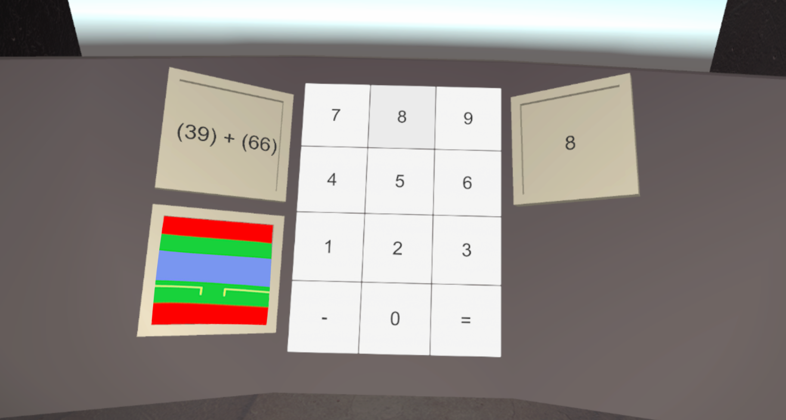

# Experiments

## progressive task

In this experiment you have to answer simple maths during a period of time  

A pause will occur and you could answer a survey if you choosed to (config file).  

After the pause it's time again to do some calculations but it will be a bit more complex.  

During all of this you have to respond as quickly as possible to the sound in order to measure your response time.  

To choose an answer aim the wanted key with your right controller and press **trigger** to select it.  

When you are satisfied select the **=** key to validate
Use the left **Joystick click** to respond the audio.  

## double task

In this experiment you have to get the artificial horizon stable with the joystick and validate.

A pause will occur and you could answer a survey if you choosed to (config file)

after the pause the artificial horizon will come back but it will also be some calculations to do 

during all of this you have to respond as quickly as possible to the sound in order to measure your response time

To get the artificial horizon stable you will use the right **joystick up** and **joystick down**

To validate you will use the **A** button (right primary button)

To choose an answer aim the wanted key with your right controller and press **trigger** to select it 

When you are satisfied select the **=** key to validate
Use the left **Joystick click** to respond the audio

## triple task

In this experiment you have to select the correct answer to the calculation between 3 buttons during 1 minute   [STEP 1]

Then you will have to guess the origin of the sound played and do the calculations                              [STEP 2]

Finally adding to the two others tasks you will have to keep the artificial horizon as flat as possible         [STEP 3]

After each step you could answer a survey if you choosed to (config file)

**WARNING** You have a limited time to complete the audio and cacul tasks.

To select the answer in the calculation press the button with any controller (in the game)

To select the origin of the sound use the left joystick : **joystick up** , **joystick down** , **joystick left** or **joystick right**

To keep the artificial horizon flat you will have to grab the levers above your head and

* To turn the artificial horizon into trigonometric direction pull the right lever
* To turn the artificial horizon clockwise pull the left lever
  * If the lever is green there is no counter rotation 
  * if it's yellow there is half speed counter rotation  
  *  if it's red  there is full speed counter rotation

# Instructions
## games tasks
 * calcul is the progressive task with **[SimpleCalcul](#simplecalcul)** and then **[ComplexCalcul](#complexcalcul)** maths with **[Audio](#audio)** 

* doubleTask is the **[SimpleCalcul](#simplecalcul)** and **[VerticalArtificialHorizon](#verticalartificialhorizon)** with **[Audio](#audio)**

* tripleTaskNoInteruption is the **[ButtonCalcul](#buttoncalcul)**, **[AudioOrigin](#audioorigin)** and **[RotationArtificialHorizon](#rotationartificialhorizon)**

* tripleTaskNASAtlx is the same as tripleTaskNoInteruption with a pause between task to answer a survey

On the triple task experiment the errors are displayed and the game stops at the fifth error.
The first four errors will not be eliminatory. 
Each time you give the wrong answer, an error is counted. 
Each time the counter drops to 0 an error is counted. 
Each time the artificial horizon exceeds 60 degrees an error is counted. 

## SimpleCalcul
Answer simple digit calculations on calculator type input using ray on controllers 
**[0-9]** to write numbers 
**[-]** for negatives numbers 
**[=]** to validate  
**[current entry]** for deleting one character 
**trigger** to select button 

## ComplexCalcul
Answer double digits calculations on calculator type input using ray on controllers 
**[0-9]** to write numbers 
**[-]** for negatives numbers 
**[=]** to validate 
**[current entry]** for deleting one character 
**trigger** to select button 

## Audio
**joystick click** when you hear a sound. 
It is used as a witness spot to measure your response time.

## VerticalArtificialHorizon
**joystick up** and **joystick down** to place the background on the line and **A** to validate

## ButtonCalcul
Press the correct answer using the controller.  There is at least one correct answer among the three shown.

## AudioOrigin
Use **joystick up**, **joystick down**, **joystick left** and **joystick right** to guess to origin of the sound.

## RotationArtificialHorizon
Use the levers to offset the rotation speed of the background. 
The left lever will offset the rotation clockwise. 
The right lever will offset the rotation anticlockwise. 

[Return to ReadMe](./../ReadMe.md)

[Go to setup](./setup.md)
