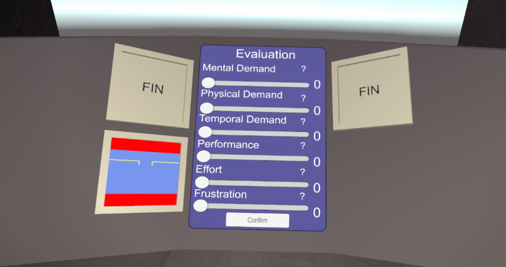

# Sensors

This headset allow us to access multiples sensors

Sensor data is saved in the location "ApplicationDataPath\SensorsCSVData\"

## Raw sensors

The recorded sensors are :
* HeartRate
* EyeGaze&nbsp;&nbsp;&nbsp;&nbsp;&nbsp;&nbsp;&nbsp;&nbsp;&nbsp;&nbsp;&nbsp;&nbsp;&nbsp;&nbsp;&nbsp;&nbsp;&nbsp;&nbsp;&nbsp;&nbsp;&nbsp;&nbsp;&nbsp;&nbsp;&nbsp;&nbsp;&nbsp;&nbsp;&nbsp;&nbsp;&nbsp;&nbsp;&nbsp;&nbsp;&nbsp;                        [L+R] &nbsp;   &nbsp;   &nbsp;   &nbsp;     [x,y,z] 
* EyeGazeConfidence    &nbsp;&nbsp;&nbsp;&nbsp;&nbsp;&nbsp;&nbsp;&nbsp;&nbsp;&nbsp;&nbsp;&nbsp;&nbsp;&nbsp;&nbsp;&nbsp;          [L+R]
* EyeOpenness        &nbsp;&nbsp;&nbsp;&nbsp;&nbsp;&nbsp;&nbsp;&nbsp;&nbsp;&nbsp;&nbsp;&nbsp;&nbsp;&nbsp;&nbsp;&nbsp;&nbsp;&nbsp;&nbsp;&nbsp;&nbsp;&nbsp;&nbsp;&nbsp;&nbsp;&nbsp;            [L+R]
* EyeOpennessConfidence  &nbsp;&nbsp;&nbsp;&nbsp;&nbsp;&nbsp;&nbsp;&nbsp;        [L+R]
* EyePupilDilation     &nbsp;&nbsp;&nbsp;&nbsp;&nbsp;&nbsp;&nbsp;&nbsp;&nbsp;&nbsp;&nbsp;&nbsp;&nbsp;&nbsp;&nbsp;&nbsp;&nbsp;&nbsp;&nbsp;&nbsp;&nbsp;&nbsp;          [L+R]
* EyePupilDilationConfidence&nbsp;&nbsp;&nbsp;&nbsp;&nbsp;     [L+R]	
* EyePupilPosition   &nbsp;&nbsp;&nbsp;&nbsp;&nbsp;&nbsp;&nbsp;&nbsp;&nbsp;&nbsp;&nbsp;&nbsp;&nbsp;&nbsp;&nbsp;&nbsp;&nbsp;&nbsp;&nbsp;&nbsp;&nbsp;&nbsp;            [L+R]  &nbsp;   &nbsp;   &nbsp;   &nbsp;    [x,y]
* CombinedGaze           &nbsp;&nbsp;&nbsp;&nbsp;&nbsp;&nbsp;&nbsp;&nbsp;&nbsp;&nbsp;&nbsp;&nbsp;&nbsp;&nbsp;&nbsp;&nbsp;&nbsp;&nbsp;&nbsp;&nbsp;&nbsp;&nbsp;&nbsp;&nbsp;&nbsp;&nbsp;&nbsp;&nbsp;&nbsp;&nbsp;&nbsp;&nbsp;&nbsp;    &nbsp;   &nbsp;   &nbsp;   &nbsp;               [x,y,z]
* CombinedGazeConfidence
* CognitiveLoadValue
* CognitiveLoadStandardDeviation

[L+R] a sensor is present for each eye 
[x,y,z] the number of dimensions contained in the vector.

## Completion informations

From the game we are saving several more informations
* **Stage** :                         get the current stage of the game. 
* **TaskAudio**  :                    when an audio task start.
* **TaskMath**      :                 when an calculation task start.
* **Stabilization**   :               when the player is interacting with artificial horizon. 
* **AnswerAudio**       :             errors and correct answer with the audio task.
* **AnswerMath**     :                errors and correct answer with the calculation task.

## Additionnal informations

More informations are saved into a text file next to the csv

After each part of the experiment the NASA-TLX questions are asked.
* **Mental Demmand** : How much mental and perceptual activity was required? Was the task easy or demanding, simple or complex?
* **Physical Demand** : How much physical activity was required? Was the task easy or demanding, slack or strenuous?
* **Temporal Demand** : How much time pressure did you feel due to the pace at which the tasks or task elements occurred? Was the pace slow or rapid?
* **Performance** : How successful were you in performing the task? How satisfied were you with your performance?
* **Effort** : How hard did you have to work (mentally and physically) to accomplish your level of performance?
* **Frustration** : How irritated, stressed, and annoyed versus content, relaxed, and complacent did you feel during the task?
  

There is also the **average response time** for the more simple task and the more complec one. 
Finally we save the **average cognitive load by part** (calculated by the headset).

[Return to ReadMe](./../ReadMe.md)
